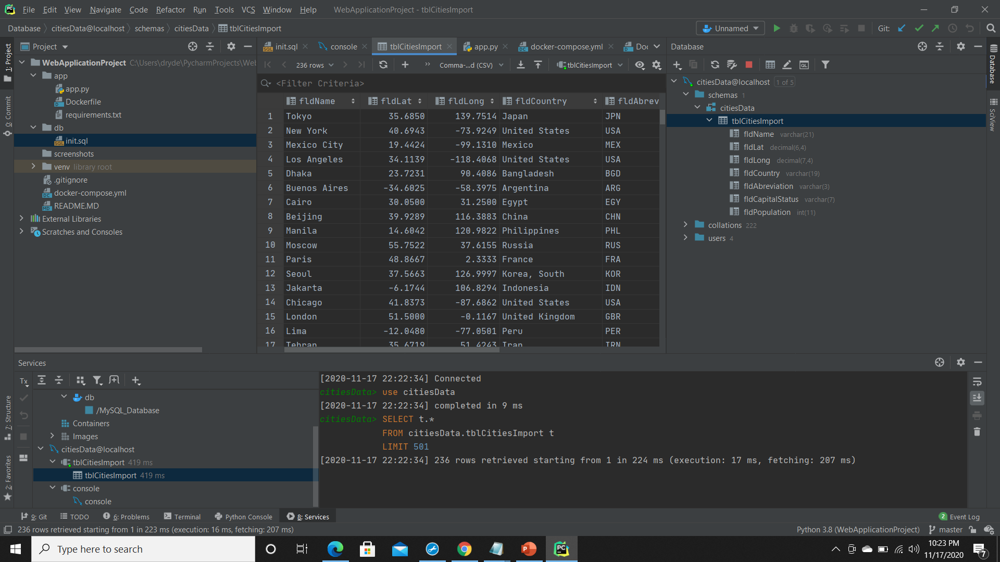
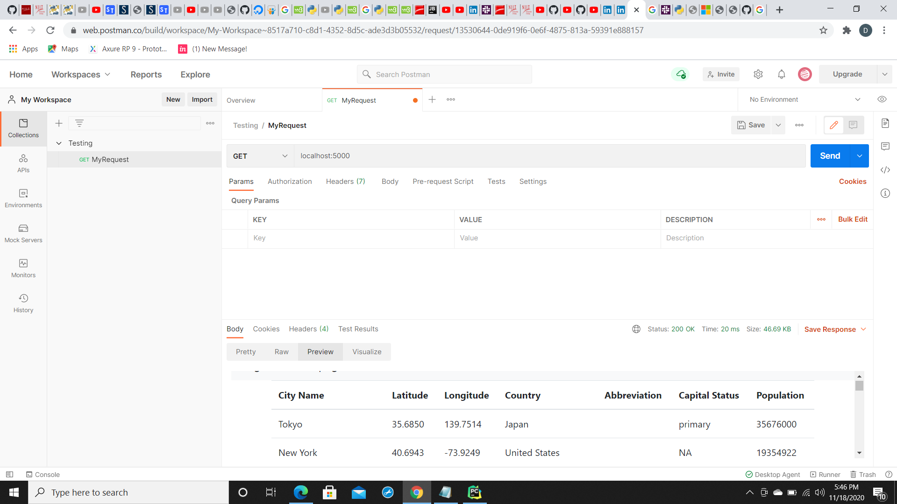

##Project Description
This project is a homework assignment to teach how to get pycharm setup with Docker, Flask, MySQL
##MySQL Screenshot

##Postman Screenshot

##Final
This Project is a Final Project for IS601 - which will include additional feature components